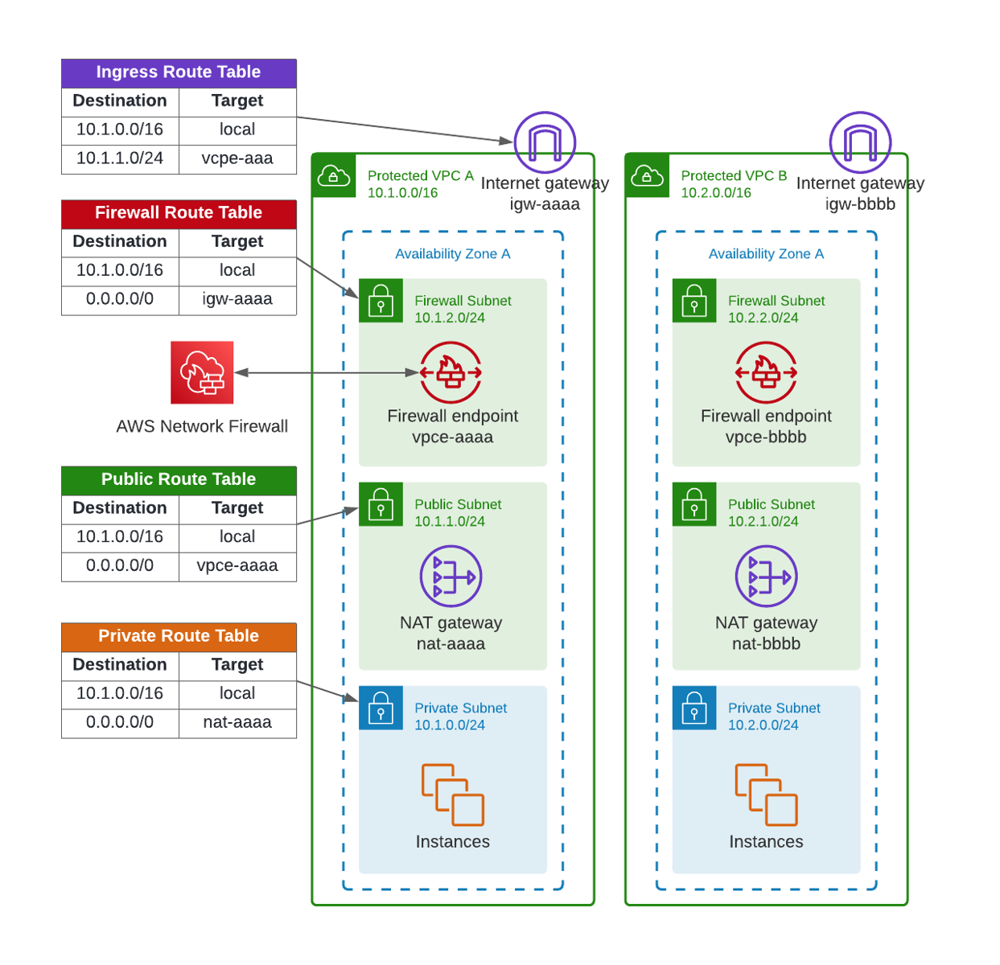

# AWS Network Firewall FQDN Demo

Terraform codes to setup AWS Network Firewall for FQDN Egress Filtering.



## Environment Variables

To run this project, you will need to set the following environment variables

Variables | Description
--- | ---
AWS_ACCESS_KEY_ID | AWS Access Key ID
AWS_SECRET_ACCESS_KEY | AWS Access Key Value
AWS_DEFAULT_REGION | AWS Default Region


## Run Locally

Clone the project

```bash
git clone https://github.com/bayupw/aws-anfw-fqdn-demo
```

Go to the project directory

```bash
cd aws-anfw-fqdn-demo
```

Set environment variables

```bash
export AWS_ACCESS_KEY_ID="ABCDEFGHIJKLMNOP"
export AWS_SECRET_ACCESS_KEY="A1b2C3d4E5f6"
export AWS_DEFAULT_REGION="ap-southeast-2"
```

Terraform workflow

```bash
terraform init
terraform plan
terraform apply -auto-approve
```
